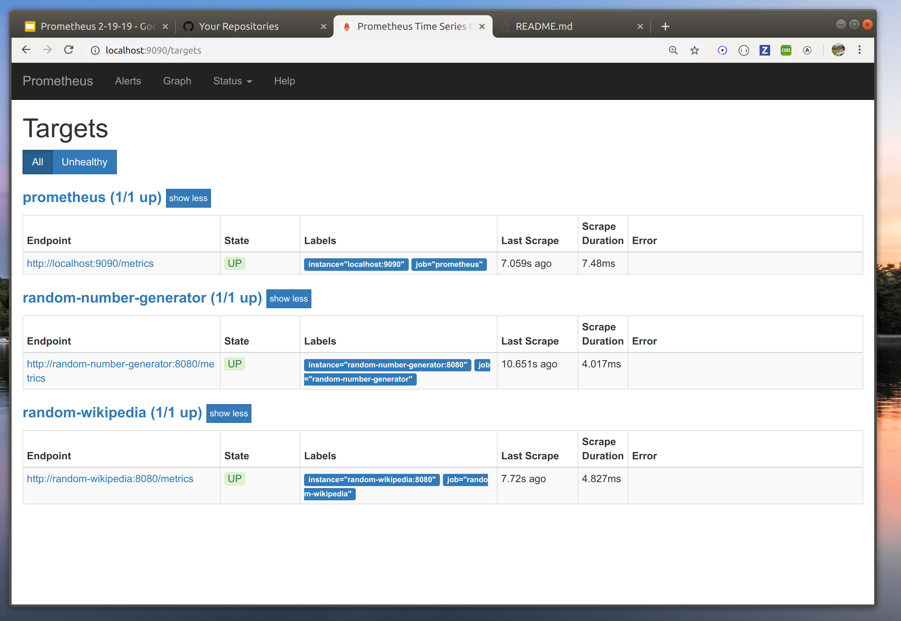
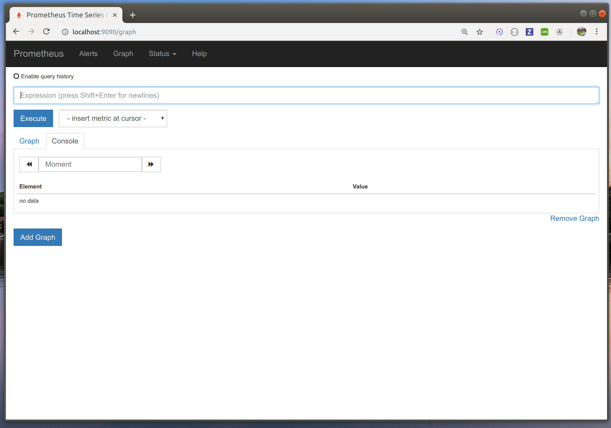

# Prometheus Workshop

https://dgoldstein1.github.io/prometheus-workshop/

This repo is a hands-on tutorial to become familiar with Prometheus. It consists of:

1. [Introduction](#introduction)
	1. [Getting Started](#getting-started)
	2. [Getting Oriented](#getting-oriented)
	3. [PromQL Metrics](#promql-metrics)
	4. [PromQL Queries](#promql-queries)
2. [Hands On Learning](#hands-on-learning)
	1. [Activity](#activity)
	2. [Challenge](#challenge)
	3. [Additional Resources](#additional-resources)
3. [Authors](#authors)
4. [License](#license)

## Introduction to Prometheus

Prometheus is a time series database which monitors service metrics easily and efficiently. It works by scraping a set of services on an interval and then exposing those metrics through an API. In this section of the walk-though we will setup a local prometheus instance with a few example services and explore Prometheus's core features.

### Getting Started

Start by cloning the `prometheus-workshop` repo.

```sh
git clone git@github.com:dgoldstein1/prometheus-workshop.git
```

Let's get our local environment up and running. In this example, Prometheus is inside its own docker image, so we won't need to install any binaries. Run the following to pull and start all the containers:

```sh
docker-compose up -d
```

After everything has started, make sure everything is running successfully with:

```sh
docker-compose ps
```

### Getting Oriented

There are now three things running: prometheus and two services which I wrote for this tutorial. Let's first look at these two services.

Make the following request to the `random-wikipedia-article` service:

```sh
curl localhost:7001/randomArticle
"Golyam Perelik (Bulgarian: Голям Перелик) is the highest peak in the Rhodope Mountains, situated 19 km to the west of Smolyan. It makes the Rhodopes the seventh highest Bulgarian mountains..."
```

This service exposes two endpoints `/randomArticle` and `/metrics`. As you can see, `/randomArticle` fetches a random wikipedia article and outputs an extract in plain text. Now let's make a request to `/metrics`:

```sh
curl localhost:7001/metrics
# HELP go_gc_duration_seconds A summary of the GC invocation durations.
# TYPE go_gc_duration_seconds summary
go_gc_duration_seconds{quantile="0"} 8.0927e-05
go_gc_duration_seconds{quantile="0.25"} 0.000111602
go_gc_duration_seconds{quantile="0.5"} 0.000130777
go_gc_duration_seconds{quantile="0.75"} 0.000187794
go_gc_duration_seconds{quantile="1"} 0.000272113
go_gc_duration_seconds_sum 0.001172767
go_gc_duration_seconds_count 8
...
```

This is where prometheus comes into play. Using the [golang prometheus client library](https://github.com/prometheus/client_golang), the `/metrics` endpoint exposes a whole bunch of information about the random-wikipedia service in a format which prometheus can easily read.

Prometheus scrapes these endpoints on a given interval. In our case, I have set this to every 1 second. If you navigate to `http://localhost:9090/targets`, Prometheus will show you all the targets it's currently scraping, their statuses, and the time since it was last scrape. Note that prometheus can also monitor itself.



Look through all the metrics for the service `random-wikipedia-article`. Are there any metrics you can understand right off the bat? A lot of these metrics are general enough to be human readable and include brief explanations after `#HELP`. 

Now Let's take a closer look at the metric `promhttp_metric_handler_requests_total`. This metric tells us the number of times the `/metrics` endpoint has been hit.

Run the command :

```sh
curl -s localhost:7001/metrics | grep _metric_handler_requests_total
# HELP promhttp_metric_handler_requests_total Total number of scrapes by HTTP status code.
# TYPE promhttp_metric_handler_requests_total counter
promhttp_metric_handler_requests_total{code="200"} 20
promhttp_metric_handler_requests_total{code="500"} 0
promhttp_metric_handler_requests_total{code="503"} 0
```

Here we can see that the `/metrics` endpoint has been hit 20 times, and all 20 of them were 200-level responses. 

Run the `curl` request a few more times. Note that `promhttp_metric_handler_requests_total{code="200"}` is incremented every time you run it. This is because we are making a request to the `/metrics` endpoint, which registers as a 200-level response for `/metrics` endpoint for the `random-wikipedia-article` service. 

If we were to run:

```sh
for i in `seq 1 100`;
do
	curl -s localhost:7001/metrics > /dev/null
done
curl -s localhost:7001/metrics | grep _metric_handler_requests_total
# HELP promhttp_metric_handler_requests_total Total number of scrapes by HTTP status code.
# TYPE promhttp_metric_handler_requests_total counter
promhttp_metric_handler_requests_total{code="200"} 121
promhttp_metric_handler_requests_total{code="500"} 0
promhttp_metric_handler_requests_total{code="503"} 0
```
We would note that the total number of "scrapes" registers as:

- the number I had before (20) +
- the number of scrapes I just did (100) +
- the number of scrapes done while that script was running (1)

= 121

This kind of metric is called a [counter](https://prometheus.io/docs/concepts/metric_types/#counter). It is only incremented or decremented. This is different than something like `go_memstats_alloc_bytes` (amount of memory the service is using), which represents a specific unit which can change drastically between scrapes. This is called a [gauge](https://prometheus.io/docs/concepts/metric_types/#gauge). These two types of metrics are the most important for promethues, but for more information on different metrics, see the [prometheus documentation](https://prometheus.io/docs/concepts/metric_types).

### PromQL Metrics

Prometheus uses its own query language called PromQL. PromQL is specially designed to handle time series-like queries and ranging over large amounts of data.

Unfortunately, PromQL has a high learning curve. If you find yourself getting frustrated, know that someone else is likely in the same situation-- don't be afraid to ask for clarification :)

Let's get started. Open up the Prometheus console by going to `localhost:9090`: 



This is the central place for experimenting with queries and debugging metrics.

Let's play around with the metric we were looking at before: `promhttp_metric_handler_requests_total`. Type "promhttp_metric_handler_requests_total" into the console bar and press "execute."

```
promhttp_metric_handler_requests_total{code="200",instance="localhost:9090",job="prometheus"}	9
...
```

We can see that we've just executed a query against our data in Prometheus. 

Note that if you open up the network tab in dev tools, you can see this request being made against `http://localhost:9090/api/v1/query?query=promhttp_metric_handler_requests_total`. Prometheus exposes `/api/{version}/query` to be used as an API endpoint. For more information see [prometheus api](https://prometheus.io/docs/prometheus/latest/querying/api/).

Let's take a closer look at our data:

```
promhttp_metric_handler_requests_total{code="200",instance="localhost:9090",job="prometheus"}	21
promhttp_metric_handler_requests_total{code="200",instance="random-number-generator:8080",job="random-number-generator"}	21
promhttp_metric_handler_requests_total{code="200",instance="random-wikipedia:8080",job="random-wikipedia"}	21
promhttp_metric_handler_requests_total{code="500",instance="localhost:9090",job="prometheus"}	0
promhttp_metric_handler_requests_total{code="500",instance="random-number-generator:8080",job="random-number-generator"}	0
promhttp_metric_handler_requests_total{code="500",instance="random-wikipedia:8080",job="random-wikipedia"}	0
promhttp_metric_handler_requests_total{code="503",instance="localhost:9090",job="prometheus"}	0
promhttp_metric_handler_requests_total{code="503",instance="random-number-generator:8080",job="random-number-generator"}	0
promhttp_metric_handler_requests_total{code="503",instance="random-wikipedia:8080",job="random-wikipedia"}	0
```

From this output, we can see that Prometheus has registered three different *labels* for out data: 
 - `code` - the response-code for the request to `/metrics`
 - `instance` - the http endpoint for that specific service
 - `job` - the name of the service

 Let's say all we care about right now is `random-wikipedia`. We can specify the name of the `job` to equal `random-wikipedia` by putting this label in our query. Enter in `promhttp_metric_handler_requests_total{job="random-wikipedia"}` into the console. Now all you should see are elements where the tag is equal to `random-wikipedia`:

 ```
 promhttp_metric_handler_requests_total{code="200",instance="random-wikipedia:8080",job="random-wikipedia"}	72
promhttp_metric_handler_requests_total{code="500",instance="random-wikipedia:8080",job="random-wikipedia"}	0
promhttp_metric_handler_requests_total{code="503",instance="random-wikipedia:8080",job="random-wikipedia"}	0
 ```

Now let's say we want to get the number of metric scrapes from 10 minutes ago for the `random-number-generator` service. We could use the modifier `offset {time}` in order to offset our data. Enter in `promhttp_metric_handler_requests_total{job="random-number-generator"} offset 10m`. You should see the values decrease for the 200-level responses, since we are looking at historical data:

```
promhttp_metric_handler_requests_total{code="200",instance="random-number-generator:8080",job="random-number-generator"}	3
promhttp_metric_handler_requests_total{code="500",instance="random-number-generator:8080",job="random-number-generator"}	0
promhttp_metric_handler_requests_total{code="503",instance="random-number-generator:8080",job="random-number-generator"}	0
```

Note that these selectors can also use regular expressions in addition to simple string matching. For example, `promhttp_metric_handler_requests_total{job=~"random.*"}` will give you results for "random-wikipedia" and "random-number-generator" but not "prometheus".

### PromQL Queries

So far we've looked at how metrics are scraped, different types of metrics, and how metrics can be grouped using labels. Now we will add how to use metrics in creating queries.

Start by launching a script which will make requests to the random-number-generator and random-wikipedia service every second.

```sh
./make_requests_to_services.sh 
making requests to services.. press ^C to exit
```

Now go back to the Prometheus console at http://localhost:9090 and look at the metric `go_goroutines`. A [go routine](https://gobyexample.com/goroutines) is akin to a new thread. You should see that each service has a few go routines running.

Let's get the average number of go routines across all services. For that we will use the function `avg`. Run the query `avg(go_goroutines)`. It will output

```
Element	Value
{}	18.333333333333332
```

This tells us that the average across all services is currently 18.3. Note the `{}`. This means that there are no labels in this value, or that there are no specific jobs, instances, or other labels associated with this response.

Now let's get the average number of go routines over the last 5 minutes. If we type in `go_goroutines[5m]` we can see the raw metrics for each service's number of go routines over the last 5 minutes. Each number and timestamp here indicates a real metric after a scrape. This type of data is different than the output of `avg(go_goroutines)`. `avg(go_goroutines)` outputs an **instant vector**, or one-dimensional array, while `go_goroutines[5m]` outputs a **range vector** or two-dimensional array.

To get the average `go_goroutines` over the last 5 minutes, we will want to iterate over the range vector `go_goroutines[5m]` and output the average (e.g. total number of routines / number of scrapes). To do this, we will use Prometheus's `rate` function. `rate` takes in a range vector and outputs the per-second rate.

```
rate(go_goroutines[5m])

Element	Value
{instance="localhost:9090",job="prometheus"}	0.14035087719298245
{instance="random-number-generator:8080",job="random-number-generator"}	0.1263157894736842
{instance="random-wikipedia:8080",job="random-wikipedia"}	0.1192982456140351
```

Looks good! 

If we wanted to take the average of all these rates of go routines we could run:

```
avg(rate(go_goroutines[5m]))
Element	Value
{}	0.21286549707602337
```


For more information on rates and averages, see [the Prometheus docs on functions](https://prometheus.io/docs/prometheus/latest/querying/functions/).

*Note -- in the real world it's not a good idea to use `rate` with a gauge like `go_goroutines`. `rate` should only be used with counters.*

#### Checkpoint

- what does `go_goroutines[5m]` give you? How is this different than `go_goroutines`?
- what is the difference between `avg(rate(go_goroutines[5m]))` and `avg(go_goroutines)`?
- what is the diffence between `sum(go_goroutines)` and `sum(go_goroutines) by (job)`?
- what is the difference bewtween `avg(rate(go_goroutines[5m]))` and `sum(rate(go_goroutines[5m]))`?

## Hands On Learning

By now you should have an introductory understanding of prometheus-- how it scrapes, stores, and accesses its data. In this section, we will apply that knowledge with two hands on activities.

### Activity

Both mock services in this environment are written with Golang, using the ["net/http" handleFunc](https://golang.org/pkg/net/http/#HandleFunc) method for routing. Go claims that whenever the router receives a request, a new go routine is spun off so that the server can handle the next request-- this feature is a major selling point of Go.

Let's use the `go_goroutines` metric to try and measure this effect. If a new go routine is created every time a request is received, the relationship between the number of go routines and the rate of requests should be *linear*. Let's see if this is true.

We can start by getting a baseline of the number of go routines. Make sure `make_requests_to_services.sh` is running. Then run the query:

```
avg_over_time(go_goroutines{job=~"random.*"}[1m]) - avg_over_time(go_goroutines{job=~"random.*"}[1m] offset 5m)
```

What is this doing? Take a second to work through this logic. 

- `go_goroutines{job=~"random.*"}[1m]` -> first we take all the metrics for `go_goroutines` over the last minute that have the `job` label `random*` (i.e. everything but prometheus)
- `avg_over_time(go_goroutines{job=~"random.*"}[1m])` -> then we take the average of all these values using `avg_over_time`. We use that instead of `avg` because `avg_over_time` takes a range vector, whereas `avg` takes an instant vector (see [docs](https://prometheus.io/docs/prometheus/latest/querying/functions/#aggregation_over_time))
- `avg_over_time(go_goroutines{job=~"random.*"}[1m] offset 5m)` -> do the same thing, but starting *5 minutes ago*
- last, we get the difference of the current average and the average 5 minutes ago. This tells us how much the number of go routines have changed in the last five minutes. Because we haven't changed anything, all our data should be close to zero. The closer to zero we can get, the more stable our baseline (control) is.

```
Element	Value
{instance="random-number-generator:8080",job="random-number-generator"}	-0.18333333333333535
{instance="random-wikipedia:8080",job="random-wikipedia"}	0
```

Now let's run our experiment. We can start by commenting out `sleep 1` in `make_requests_to_services.sh`. This will increase out request rate / second to infinity so that we can see a measurable effect on the increase of go routines. Once you've commented out that line, restart `make_requests_to_services.sh`. Wait five minutes, and then run the same query again. 

- If you don't want to wait you can modify the query to have an offset of `1m`, but `5m` gives a more definitive result
- If you're not really seeing any changes, it's possible you're not making enough requests, try running more than one instance of `

make_requests_to_services.sh`

```
{instance="random-number-generator:8080",job="random-number-generator"}	
Element	Value
{instance="random-number-generator:8080",job="random-number-generator"}	-0.14999999999999858
{instance="random-wikipedia:8080",job="random-wikipedia"}	4.583333333333336
```

These are interesting results. We can see that random-wikipedia increases in go_routines as the request rate increases. However, random-number-generator remains the same. Click on the "graph" tab.


This graph shows us our query over time. Since our query is showing the rate of change over 5 minutes, what we are seeing is the rate of change over time. This is called a [time derivative](https://en.wikipedia.org/wiki/Time_derivative). 

What does this time derivative show us? Between 16:05-16:15, we have a ten minute baseline where the number of go routines doesn't change. For the wikipedia service, from 16:15-16:20, out rate of change increases, telling us that the number of go routines is increasing. At 16:20 or so, our rate of change levels off, telling us that the number of go routines is no longer increasing and has started to reach a "stable" state. As expected, the random-number generator doesn't increase in go routines.

The reason (I believe) what the wikipedia service behaves differently from the random-number service is because the wikipedia service makes an external call to wikipedia (expensive) while all the random-number service has to do is generate random byte with a unix timestamp. In essence, these data provide us with evidence that the random-number services *scales* much better than the wikipedia service.

If you're curious about this, you can look into the source code for each service to see how they're structured:

- [random-wikipedia](https://github.com/dgoldstein1/random-wikipedia/blob/master/random-wiki.go)
- [random-number](https://github.com/dgoldstein1/random-number-generator/blob/master/number_generator.go)

Here are some questions which you can answer, building on the skills exercised above:

- analyze the time derivates for `process_virtual_memory_bytes`, `go_memstats_gc_cpu_fraction`, and `go_memstats_sys_bytes` using the queries above
- how do these results compare with `go_goroutines`? Why do they differ?
- what do these results tell us about local docker? 
- Pair up with a cross-operating system buddy. How do your results differ between OSX and Linux?

### Challenge

Using the data collection methods demonstrated in the above activity, create a mathematical model for the wikipedia service request rate vs. the number of go_routines in use.

- modify `make_requests_to_services.sh` to increase the request rate linearly each minute over a ten minute interval
- run `avg_over_time(go_goroutines{job=~"random.*"}[1m]) - avg_over_time(go_goroutines{job=~"random.*"}[1m] offset 5m)
` and see what type of increase you're getting (exponential, linear, log?)
- use [predict_linear](https://prometheus.io/docs/prometheus/latest/querying/functions/#predict_linear) to predict future usage over the next 10 minutes and save these results
- run `make_requests_to_services.sh` for ten more minutes with the step increasing from where it left off
- measure the difference in actual vs. predicted to show the quality of your model

### Additional Resources

- [Prometheus docs](https://prometheus.io/docs/introduction/overview/)
- [Robust Perception, quality tutorials and examples](https://www.robustperception.io/blog)
- [Hands on tutorial from PromQL](https://timber.io/blog/promql-for-humans/)

## Authors

* **David Goldstein** - [davidcharlesgoldstein.com](http://www.davidcharlesgoldstein.com/?prometheus-workshop)

## License

This project is licensed under the MIT License - see the [LICENSE.md](LICENSE.md) file for details

